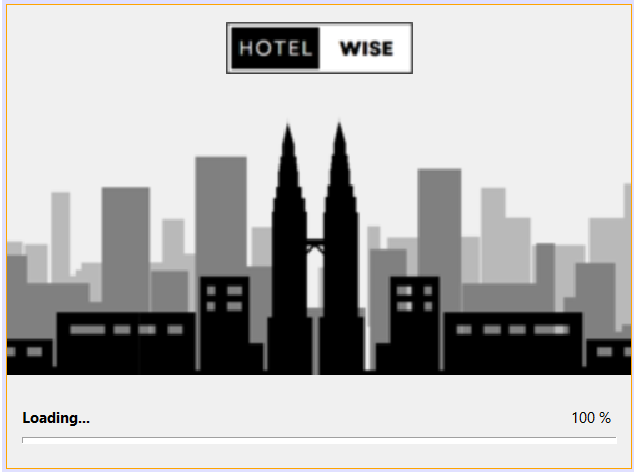
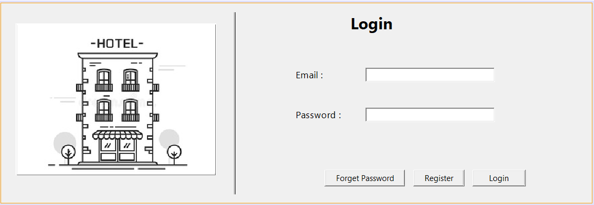
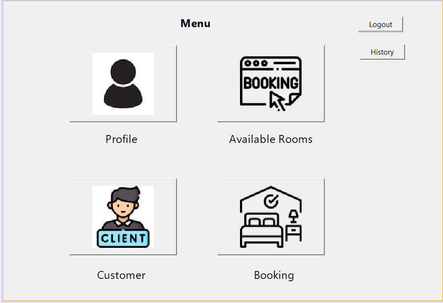
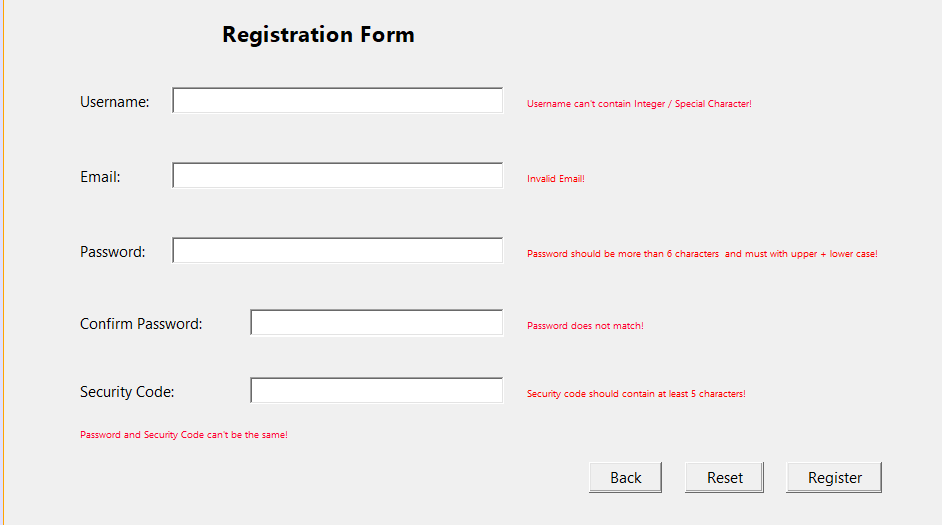
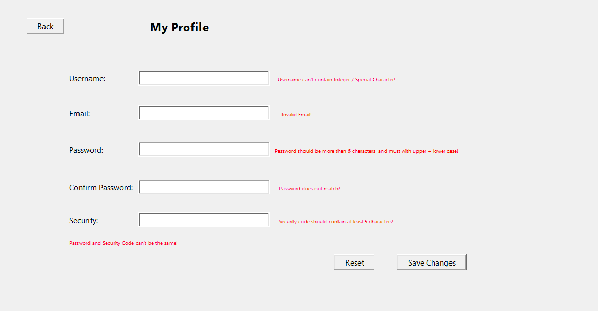
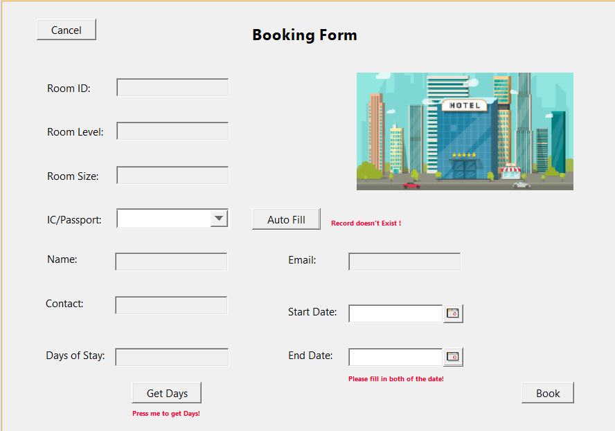
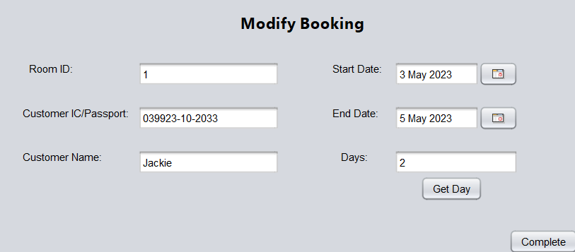
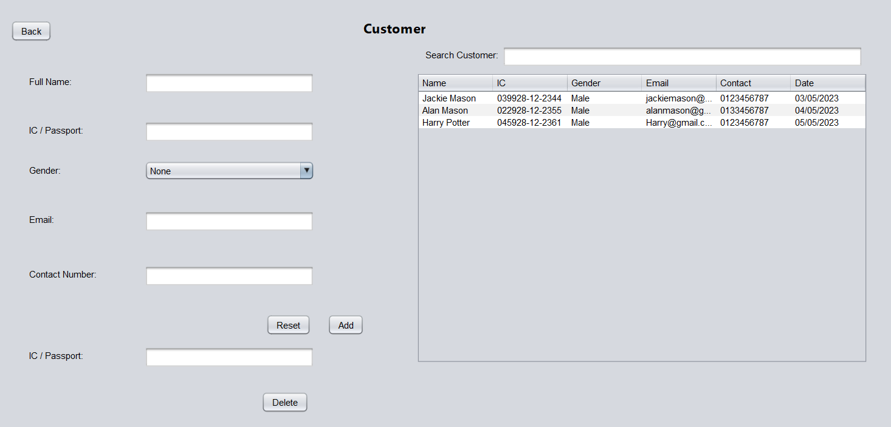
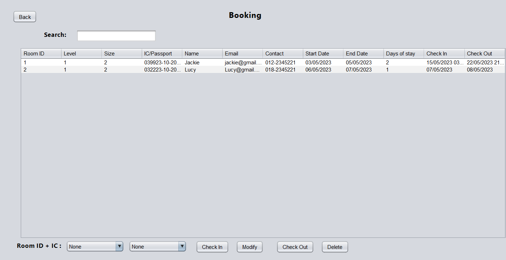
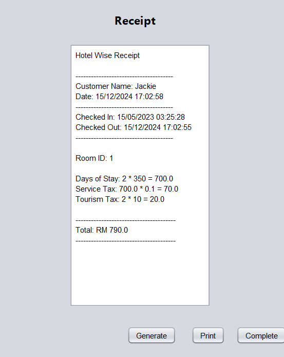

# Hotel-Wise (Hotel Management System)

A Hotel Management System (Names as Hotel Wise) Built with Java Programming Language and Java Swing Library. 

## Requirements:

- Java SDK Version >= 19

- Netbeans IDE Version >= 16 (Preferable) (or Any Relevant IDE)

## Functionalities:

1. Authentication -> Login, Forget Password & Register User 
2. CRUD on Hotel Room Operations [Booking, Cancellation, Modifications]
3. CRUD on Customers' Information 
4. Searching and Filtering Available or Occupied Rooms
5. Report Generation
6. Record History Data
7. Receipt Generation
8. Information Validation

# UI:
                     


# Setup:
Step 1:
```bash
git clone https://github.com/Sjiaseng/Hotel-Wise.git
```

Step 2:

Open Folder in Netbeans IDE -> Execute Program


## Text Files Introduction:
- Login.txt -> Record Staff Information
- Customer.txt -> Record Customer Information
- Room.txt -> Record Room Information
- Booking.txt -> Record Room Booking Information
- History.txt -> Record Completed Booking Process & Report Generation
